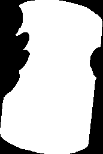
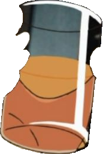

# Jacked Atlas
a tool for clipping regions of interest based on a bitmap mask, which is commonly referred to as an atlas.  
under the hood, I'm simply utilizing an `OffscreenCanvas` with `ctx.globalCompositeOperation = "source-in"` to clip  
there are several ways of going about extracting masked regions of interest from an image.  
but in general, you need 3 sets of information/data:
- **base image**
  - can be anything accepted by `ctx.drawImage` (aka `CanvasImageSource`)
- **bitmap of mask**
  - can be anything accepted by `ctx.drawImage` (aka `CanvasImageSource`)
  - can be either a boolean `Array` or `Uint8Array` of y-major stream of pixel data (`px_data = [x0y0, x1y0, x2y0, ..., x0y1, x1y1, ...]`)
  - can be ~~scanline~~ drawing instructions (TODO)
- **offset position of mask**
  - [x, y, width, height] = [185, 184, 172, 258]

the source is written in `Typescript` and the documentation is generated using `TypeDoc`.  

### Example
input base image:

| description | data |
| ----------- | ----------- |
| input base image |  |
| input juice bitmask |  |
| input mask rect coordinates | `let [x, y, width, height] = [185, 184, 172, 258]` |
| output extracted image |  |

